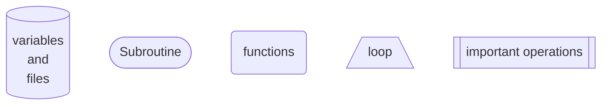
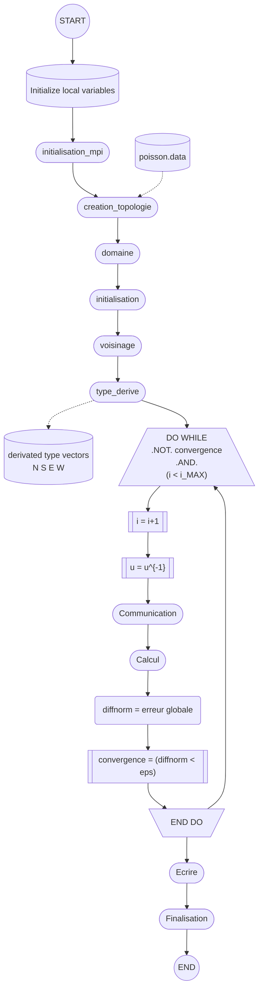

# STRUCTURE OF THE CODE AND ADVANCEMENT OF THE PROJECT
___

___
## content list by file with their state of completion

    - parallel.f90
> ***initialisation_mpi*** (subroutine)
>> initialize MPI  **&#9745;** 
>
>> Know proc nb **&#9745;**
>
>> Know global nb of proc **&#9745;**

> ***creation_topologie*** (subroutine)
>> Read nb of nodes in X and Y **&#9745;**
>
>> Divide procs in X and Y **&#9745;**
>
>> Create subsequent 2D grid **&#9745;** (no grid object exists so this step is just about removing periodicity)

> ***domaine*** (subroutine)
>> Know the sub-domain topology's coordinates **&#9745;**
>
>> Compute the max and min indexes of the subdomain along X **&#9745; (corrected)**
>
>> Compute the max and min indexes of the subdomain along Y **&#9745; (corrected)**

> ***voisinage*** (subroutine)
>> write the indexes of the subdomains's proc to the N and S subdomains **&#9745;**
>
>> write the indexes of the subdomains's proc to the E and W subdomains **&#9745;**

> ***type_derive*** (subroutine)
>> Create a derived type variable for the north and south horizontal vectors **&#9744;**
>
>> Create a derived type variable for the east and west vertical vectors **&#9744;**

> ***communication*** (subroutine)
>> send to North and receive from South **&#9744;**
>
>> send to South and receive from Nouth **&#9744;**
>
>> send to West and receive from East **&#9744;**
>
>> send to East ans receive from West **&#9744;**

> ***erreur globale*** (function)
>> Compute local error **&#9745;**
>
>> Compute global error **&#9744;**

> ***ecrire_MPI*** (subroutine)
> (NB: I did not quite catch the step of this one as I'm not very familiar with parallel writing methods. This will be corrected in due time)
>> Change the error handling wizard for files **&#9744;**
>
>> Open "donnees.dat" for writing **&#9744;**
>
>> Create derived type variable for the u matrix without the phatom points **&#9744;**
>
>> Create derived type for the final matrix which is going to be written **&#9744;**
>
>> Define the view on the file of the matrix from the start **&#9744;**
>
>> Write the u matrix with the view **&#9744;**
> 
>> Close the file **&#9744;**
>
>> clean the types **&#9744;**

> ***finalisation_mpi*** (subroutine)
>> Clean the types and comms **&#9744;**
>
>> Deactivate MPI **&#9745;**

    - calcul_poisson.f90
>>

    - read.f90
>>

## functional diagram of the program

___

